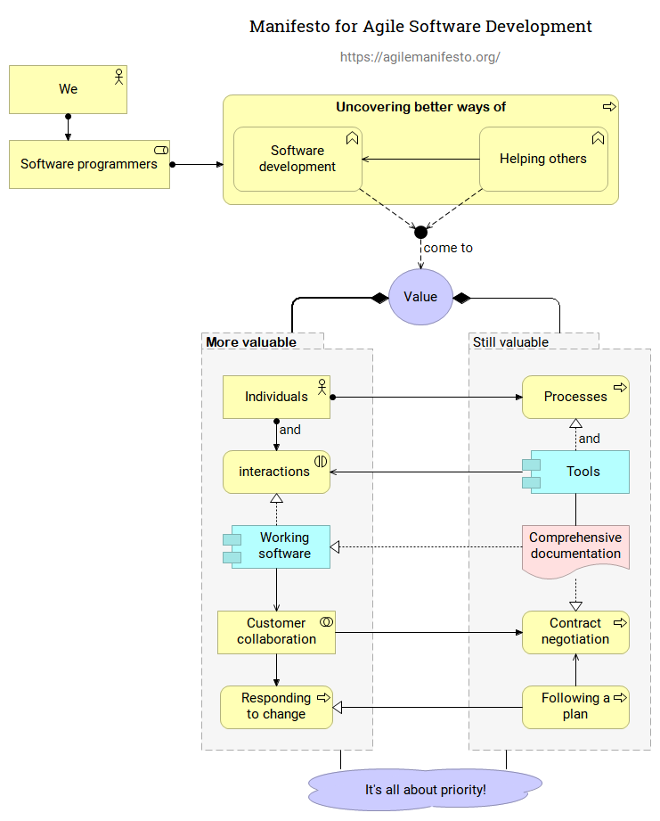

# Agile manifesto in ArchiMate

Translations are below :
* `Russian  (русский перевод – ниже).`
* `French translations are below (русский перевод – ниже).`

## Agile manifesto

Source file: [Agile-Manifesto.archimate](Agile-Manifesto.archimate)

## 12 Principles of Agile Software

Source file: [Agile-Manifesto.archimate](Agile-Manifesto.archimate) (same file as above).

## Манифест Agile-разработки программного обеспечения

.png)

Source file: [Agile-Manifesto-(RUS).archimate](Agile-Manifesto-(RUS).archimate)

## 12 принципов Agile-разработки программного обеспечения

.png)

Source file: [Agile-Manifesto-(RUS).archimate](Agile-Manifesto-(RUS).archimate) (same file as above).

## Le manifeste Agile (Français)

Source file: [Agile-Manifesto-(FRA).archimate](Agile-Manifesto-(FRA).archimate)

## 12 Principes du développement Agile (Français)

Source file: [Agile-Manifesto-(FRA).archimate](Agile-Manifesto-(FRA).archimate) (Même fichier pour les 2).

